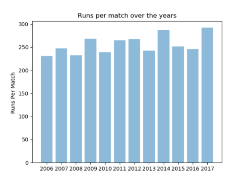
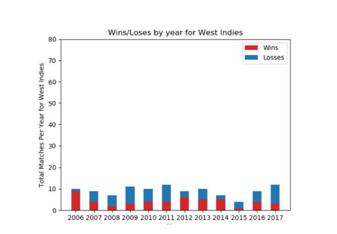
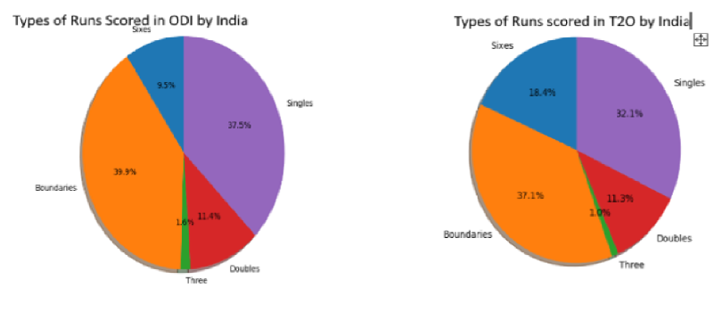

## Data-Driven Modeling for Winner Prediction in a Cricket Match

## Data source

CricSheet: https://cricsheet.org/

## Overview
We wanted to leverage the fact that this data set gives us ball to ball information of every match. This was a crucial information, with which multiple predictions and conclusions were possible.
As we had data about the team matches played, it was possible to predict the winner based on past matches. Many features given in the data set like venue, bowler to batsman ball by ball performance, can be used to somewhat predict the winner of the match. 
Thus, we could predict the winner of the next match International ODI or T20 match based on the players performance in past matches.
## Task

1. Predict which of the given two teams would win

3. Predicting if a given team could win while chasing

For detailed insights about methodolgy used for acchieving aforementioned tasks, please find the [Report](https://github.com/deepacefic/CricML/blob/main/DeepPooja(17074)-Project-Report%20(1).pdf)

## Data analysis

## Results Table

| Classifier       | Accuracy Team Win(%)  | Accuracy Team Win while chasing(%)        
| ------------- |:-------------:|:--------------:|
|   Logistic Regression    | 55.87 | 52.13|
| Decision Trees      | 53.23| 51.81|
| support vector machine | 73.77| 61.63| 
| 3-hidden layer Neural Network |67.12| 59.22|

**Reference Papers**

[CricAI: A classification based tool to predict the outcome in ODI cricket](https://ieeexplore.ieee.org/abstract/document/5715668)

[Auto-play: A Data Mining Approach to ODI Cricket Simulation and Prediction](https://epubs.siam.org/doi/abs/10.1137/1.9781611973440.121)

### Support or Contact

Please write us an [Email](deep17@iiserb.ac.in) if you have questions.

We are glad to get any comments and error reports.
